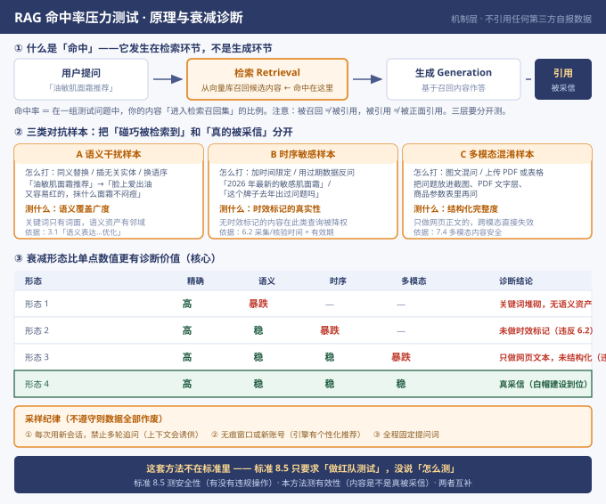

# GEO 命中率压力测试操作手册 v1

> **一句话定位**：这份手册解决一个问题——**怎么判断 AI 是真的采信了你的内容，还是只是碰巧检索到了你。**
>
> **版本**：v1 · 2026-08-29
> **适用对象**：GEO 服务使用方（甲方）、GEO 从业者、品牌方市场负责人
> **方法成本**：不依赖任何付费工具，Excel + 三个 AI 引擎即可完成

---

## 0 开篇：必须先说清楚的三件事

### ① 这套方法不在 T/CAPT 026—2026 标准里

我在整理过程中核过一遍：**《生成式引擎优化（GEO）可信信息传播与信息生态治理规范》（T/CAPT 026—2026）全文中，没有「命中率」「压力测试」「对抗样本」这些词。**

标准里真实存在的是 **8.5「应急演练与红队测试」**：

> L2 及以上服务提供方宜结合项目风险建立应急演练机制，对语料投毒、提示词注入、伪共识、答案霸权、重大事实错误、AI 标识违规和平台反馈异常等情形进行演练并留存记录。**L3 服务提供方宜定期开展红队测试或对抗性验证**，检查隐藏指令、异常元数据、多模态注入、智能体诱导、竞品抹黑、商标劫持或流量劫持和追溯链断裂等风险，并将测试发现纳入整改和复测。

**标准是「要求做测试」，但没说「怎么做」。这套方法填的就是这个空位。**

### ② 本手册不引用任何第三方的实测百分比

市面上流传的「10 万次压力测试，合规服务商命中率 91.7%，造假服务商骤降至 34.2%」这类数据，**溯源下来是单一服务商的自报自测数据**，无第三方核验，且发布载体是技术社区的内容营销文章。

**这类数据正是 GEO 攻击的典型形态**——用「代码块 + 对比表格 + 百分比」的形式，让自己看起来客观，从而被 AI 采信并排进检索结果前列。

**本手册只讲机制和可复现的方法，所有数字请你自己跑出来。**

> 引用任何数字前，先问三句：
> ① 这个数字是谁测的？
> ② 测试方法公开吗？
> ③ 测试方有没有利益关系？
> 三者任一存疑，就只用机制描述，不引用数字。

### ③ 标准 8.5 和本方法测的是两件事

| | 标准 8.5 红队测试 | 本手册的压力测试 |
|---|---|---|
| **测什么** | **安全性**——有没有违规操作 | **有效性**——内容是不是真被采信 |
| **检查对象** | 隐藏指令、异常元数据、多模态注入、智能体诱导、竞品抹黑、商标劫持、追溯链断裂（7 类） | 语义覆盖、时效标记、结构化完整度 |
| **结果用途** | 合规整改 | 效果诊断 |

两者互补，不互相替代。

---

## 1 原理：什么叫「命中」

### 1.1 命中发生在检索环节，不在生成环节



AI 回答一个问题分两步：

```
用户提问 → 【检索 Retrieval】→ 【生成 Generation】→ 输出答案
              ↑ 命中发生在这里
```

**「命中」＝ 你的内容进入了 AI 的检索召回集。**

### 1.2 三个层次必须分开测（这是最容易被糊弄的地方）

| 层次 | 含义 | 谁在测 |
|---|---|---|
| **被召回** | 内容进入了检索候选集 | 部分工具能测 |
| **被引用** | AI 真的在答案里用了你的内容 | 少数工具能测 |
| **被正面引用** | 引用时是推荐语境，不是中性列举或负面 | **几乎没人测** |

**服务商给你的「可见性从 15% 提升到 70%」，绝大多数只测了第一层。**

而甲方付钱买的是第三层。

### 1.3 命中率的定义

> **命中率 =（在测试问题集中，你的内容被 AI 召回 / 引用的问题数 ÷ 总测试问题数），结果换算成百分比**

注意：**这个数字本身没有意义，它的衰减形态才有意义。** 详见第 3 章。

---

## 2 方法：三类对抗样本

**核心思路**：普通提问只能测出「碰巧被检索到」，**变异提问才能测出「真的被采信」**。

### A 语义干扰样本

| 项 | 内容 |
|---|---|
| **怎么打** | 同义替换 / 口语化 / 插入无关实体 / 换语序 / 省略关键词 |
| **示例** | 「油敏肌面霜推荐」→「脸上爱出油又容易红的，抹什么面霜不闷痘？」 |
| **测什么** | **语义覆盖广度** |
| **机制** | 关键词堆砌优化的只是「词面」——用户换个说法就抓瞎；真正的语义资产在向量空间里有「邻域」，换任何说法都在检索半径内 |
| **对应标准** | 3.1 GEO 官方定义中的「语义表达……优化」 |

### B 时序敏感样本

| 项 | 内容 |
|---|---|
| **怎么打** | 加时间限定词 / 用过期数据反问 / 问历史变更 |
| **示例** | 「2026 年最新的敏感肌面霜」/「这个牌子去年出过问题吗」 |
| **测什么** | **时效标记的真实性** |
| **机制** | AI 处理时效性查询时会优先近期信源；没有采集时间、最近核验时间、有效期绑定的内容会被降权 |
| **对应标准** | 6.2 核心事实主张九项证据要素中的「采集时间 / 最近核验时间 / 有效期」 |

### C 多模态混淆样本

| 项 | 内容 |
|---|---|
| **怎么打** | 图文混问 / 上传 PDF / 把问题放进商品参数表 / 截图提问 |
| **示例** | 把竞品对比表截成图，问「这两款哪个更适合敏感肌」 |
| **测什么** | **结构化完整度** |
| **机制** | 只优化网页正文的内容，在跨模态场景下直接失效 |
| **对应标准** | 7.4 多模态内容安全（要求核验可见内容、隐藏文字层、字幕、封面、OCR 识别结果、元数据、水印） |

---

## 3 诊断：衰减形态比单点数值更有价值

### 3.1 为什么衰减形态比单点数值重要

甲方拿到的对照基线是**服务商报的数**——他们自己也不知道「多高算够」。

但**衰减形态是不可伪造的**。

> 你说你命中率 90%，没用。
> 你说你 精确 90% → 语义 78% → 时序 74% → 多模态 71%，**衰减 19 个百分点**，那就能诊断了。

### 3.2 四种衰减形态的诊断结论

| 形态 | 精确 | 语义 | 时序 | 多模态 | 诊断结论 | 对应违规 |
|---|---|---|---|---|---|---|
| **1** | 高 | **暴跌** | — | — | 关键词堆砌，没有语义资产 | 不符合 3.1 定义精神 |
| **2** | 高 | 稳 | **暴跌** | — | 未做时效标记与更新 | **违反 6.2** |
| **3** | 高 | 稳 | 稳 | **暴跌** | 只做网页文本，未做结构化 | **违反 7.4** |
| **4** | 高 | 稳 | 稳 | 稳 | **真采信**（白帽建设到位） | 合规 |

**形态 2 和形态 3 直接对应标准条款**——这两条可以直接写进验收条款：

> 乙方交付内容在时序敏感样本测试中命中率衰减超过 X%，视为未按 6.2 完成证据要素绑定；
> 在多模态样本测试中命中率衰减超过 X%，视为未按 7.4 完成多模态内容核验。

### 3.3 衰减幅度的参考判定

**先说清楚：以下不是行业标准，是我基于机制推演的建议值，你需要用自己的实测数据校准。**

| 衰减幅度 | 参考判定 |
|---|---|
| < 10 个百分点 | 语义资产建设较扎实 |
| 10–25 个百分点 | 存在明显短板，需针对性补强 |
| > 25 个百分点 | 高度疑似关键词堆砌，建议重新评估服务商 |

---

## 4 实操：四步 SOP

### Step 1 建基线问题集（约 30 分钟）

为客户行业建 **20–30 题**，覆盖三个层次：

| 层次 | 题量 | 示例 |
|---|---|---|
| **认知层** | 5–8 题 | 「什么是 XX」「为什么会出现 XX」 |
| **对比层** | 5–8 题 | 「XX 和 XX 有什么区别」「怎么选」 |
| **选型层** | 8–12 题 | 「XX 找谁做」「XX 哪家好」「XX 哪里买」 |

**要点**：
- 选题要看**用户真实会怎么问**，不是看企业想怎么被问
- 选型层题目商业价值最高，占比应该最大
- 每题明确「期望出现什么」（品牌名 / 产品名 / 具体卖点）

### Step 2 生成变体（约 30 分钟）

每题生成 3 个变体：

- **1 个语义干扰变体**（口语化 / 同义 / 插实体）
- **1 个时序变体**（加时间词 / 过期数据）
- **1 个多模态变体**（截图 / PDF / 参数表）

**要点**：变体要写得像人话，**不要写成考试题**。如果变体读起来像机器人问的，测出来的数据没有意义。

### Step 3 采样（约 2–3 小时）

**三条采样纪律（不遵守则数据全部作废）**：

| 纪律 | 原因 |
|---|---|
| **① 每次用新会话** | 在同一对话里多轮追问，AI 会顺着上下文答，等于诱供。标准附录 E 明确要求「多轮独立会话」 |
| **② 无痕窗口或新账号** | 引擎有个性化推荐，用自己的常用账号测会系统性偏高。附录 E 要求「多账号、多地域或多终端采样」 |
| **③ 固定提问词，全程不换** | 中途换词 = 数据不可比 |

**记录四列**：是否召回 / 是否引用 / 引用顺位（第几个被提到）/ 引用语境（正面推荐 / 中性列举 / 负面）

### Step 4 计算与出报告（约 1–2 小时）

算出四个数：精确命中率、语义扩展命中率、时序命中率、多模态命中率。

**画成衰减曲线图给客户看**——客户看不懂百分比，但看得懂「往下掉的线」。

---

## 5 客户报告模板（可直接使用）

```
━━━━━━━━━━━━━━━━━━━━━━━━━━━━━━━━━━
  GEO 效果压力测试报告
  客户：XXX        测试日期：2026-XX-XX
  测试人：XXX      引擎：豆包 / 元宝 / DeepSeek
━━━━━━━━━━━━━━━━━━━━━━━━━━━━━━━━━━

【一】测试设计
  · 基线问题数：XX 题（认知 X / 对比 X / 选型 X）
  · 变体总数：XX 题
  · 采样方式：新会话 × 新账号 × X 引擎
  · 采样轮次：X 轮

【二】命中率结果
  精确匹配        XX%
  语义扩展        XX%    衰减 XX pt
  时序敏感        XX%    衰减 XX pt
  多模态混淆      XX%    衰减 XX pt

【三】衰减形态判定
  形态：□1 □2 □3 □4
  主要短板：______________________

【四】诊断结论
  （对应标准条款，如：时序维度衰减 XX pt，
   表明交付内容未按 6.2 完成采集时间 /
   最近核验时间 / 有效期绑定）

【五】整改建议
  1. ______________________
  2. ______________________

━━━━━━━━━━━━━━━━━━━━━━━━━━━━━━━━━━
  说明：本报告数据为采样观察结果，
  不构成对模型输出结果的承诺或保证。
━━━━━━━━━━━━━━━━━━━━━━━━━━━━━━━━━━
```

---

## 6 法律边界与内容化原则

### 6.1 三条不能碰

| ❌ 不能做 | ✅ 正确做法 |
|---|---|
| 点名说「XX 公司数据造假」 | 公布测试方法，让甲方自己跑 |
| 给结论性评价 | 给原始证据 + 可复现步骤 |
| 情绪化指控 | 中立可执行的检测清单 |

**法律依据**：《反不正当竞争法》第十一条禁止编造、传播虚假或误导性信息损害竞争对手商誉。

**但「公布行业通用的检测方法」不在此列**——这是受保护的技术交流与合规建议行为。

### 6.2 如果你要把测试过程做成内容

原则只有一条：**讲机制，不讲恩怨**。

| ❌ 不要这样 | ✅ 要这样 |
|---|---|
| 「我揭穿了 XX 公司」 | 「我发现一个行业现象：只测精确匹配会让可见性数据看起来很漂亮」 |
| 给结论性评价 | 给测试方法 + 原始数据 |
| 情绪化指控 | 「这是我的验证方法，你也可以自己跑一遍」 |

**这样做出来的内容，价值在于**：你不是在骂人，你是在**演示「如何分析 AI 的采信机制」**——这本身就是最硬的 GEO 实战教学。

---

## 7 为什么这个位置值得做

| 玩家类型 | 做不做这件事 | 原因 |
|---|---|---|
| **服务商** | 不会做 | 做了就是自证其罪 |
| **检测工具商**（数据核验类） | 做的是「你报的数真不真」，不是「你的内容真不真」 | 定位不同 |
| **咨询公司** | 不知道标准 8.5 有这个要求 | 标准发布仅 18 天 |
| **独立顾问** | **可以做** | 懂标准 + 完全中立 + 不做执行 |

**而且这是标准里的硬指标**：能做红队测试 = 达到 L3 综合治理能力（10.5）。

---

## 8 数据来源与免责

| 类型 | 说明 |
|---|---|
| **【标准原文】** | T/CAPT 026—2026《生成式引擎优化（GEO）可信信息传播与信息生态治理规范》，中国新闻技术工作者联合会 2026-08-11 发布 / 08-12 实施。文中标注条款号的均为原文引用 |
| **【方法设计】** | 三类对抗样本与衰减诊断方法为本人基于检索机制原理设计，非标准内容 |
| **【判定阈值】** | 第 3.3 节的衰减幅度参考值为机制推演建议，非行业标准，需用实测数据校准 |

**免责声明**：

1. 本手册为方法论分享，不构成任何投资、创业或商业建议。
2. 文中方法基于检索增强生成（RAG）的一般性原理，不同引擎的实现存在差异，效果因行业、执行力度与时机而异。
3. AI 引擎算法持续迭代，本方法需随引擎变化调整。
4. 本手册不引用任何第三方的实测百分比数据，所有结论请用你自己的实测数据验证。
5. 使用本方法评估服务商时，请保持客观中立，避免商业诋毁风险。

---

**作者信息**

**海风** · AI 落地咨询 & GEO 优化

微信：frankhzheng（加微信请备注「GEO」来源）

开源：https://github.com/frankhzh-source/claw-workspace
